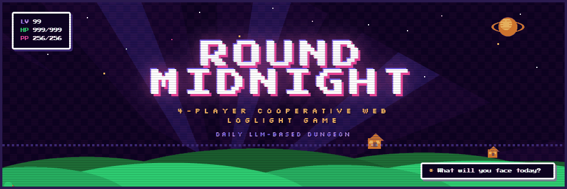

# Round Midnight

> 자정이 지나면, 이상한 일이 시작된다.

4인 협동 웹 로그라이트.
모바일 웹 브라우저로, 침대에서 자기 전에 15분.

## 코어 루프

```
웨이브 시작 (적 1마리 조우)
  → LLM이 상황 묘사 + 4명 각자에게 서로 다른 선택지 생성
  → 4명 동시에 선택지 고름 (10초)
  → 4명 동시에 d20 주사위 굴림
  → LLM이 "4명의 선택 + 4개의 주사위" 조합으로 전투 서술
  → 적 생존 시: 새 선택지만 생성 → 전투 반복
  → 적 사망 시: 전리품 획득 → 정비 세션 (장비 관리 + 투표)
  → 다음 웨이브 또는 런 종료
```

**핵심:** 선택이 방향을 정하고, 주사위가 강도를 정한다.

## 캐릭터

| 배경 | 특성 | 약점 | 보정 |
|------|------|------|------|
| 전직 경비원 | 용감한 | 어둠을 무서워함 | physical/defensive +2 |
| 요리사 | 호기심 많은 | 거미 공포증 | creative +2 |
| 개발자 | 겁 많은 | 사회적 상황에 약함 | technical +2 |
| 영업사원 | 말빨 좋은 | 체력이 약함 | social +2 |

## 주사위 시스템

| d20 결과 | 판정 | 설명 |
|----------|------|------|
| 20 (nat20) | 영웅적 순간 | 항상 성공, 적에게 3배 데미지 |
| DC+critMin 이상 | 크리티컬 | 강력한 성공, 2배 데미지 (critMin 기본 5, crit_expand로 감소) |
| DC 이상 | 성공 | 보통 성공 |
| DC 미만 | 실패 | 실패, 약간의 피해 |
| 1 (nat1) | 황당한 재앙 | 항상 실패, 풀 데미지 |

## 기술 스택

- **Frontend**: React + TypeScript + Tailwind CSS + Zustand
- **Backend**: Node.js + Express + Socket.io
- **AI**: Claude API (선택지 생성 + 전투 판정 + 내러티브)
- **Deploy**: Vercel (클라이언트) + Railway (서버)
- **CI**: GitHub Actions (타입체크 + 빌드)

## 로컬 실행

```bash
npm install
npm run dev
```

개별 빌드:
```bash
npm run build --workspace=@round-midnight/client
npm run build --workspace=@round-midnight/server
```

## 환경 변수

```bash
# server/.env
ANTHROPIC_API_KEY=your_api_key    # Claude API (없으면 하드코딩 폴백)
CLIENT_URL=https://your.domain    # CORS 허용 origin (없으면 localhost)
PORT=3000                         # 서버 포트 (Railway 자동 주입)

# client/.env
VITE_SERVER_URL=https://server.domain  # 서버 URL (없으면 localhost:3000)
```

## 프로젝트 구조

```
round-midnight/
├── client/src/
│   ├── components/
│   │   ├── Lobby/             # LobbyScreen, CharacterSetup
│   │   └── Battle/            # BattleScreen, MaintenanceScreen, SituationBox, DiceRoll 등 11개
│   ├── assets/
│   │   ├── sprites/           # box-shadow 픽셀아트 (10종, scale 5~7)
│   │   ├── backgrounds/       # 스테이지 기반 CSS gradient 배경 (기본+중보스+최종보스)
│   │   └── effects/           # 전투 이펙트 (5종)
│   ├── hooks/useSocket.ts
│   ├── stores/gameStore.ts    # Zustand (RunPhase 기반)
│   └── styles/theme.ts
├── server/src/
│   ├── ai/                    # LLM 연동 (5 모듈)
│   │   ├── client.ts          # Anthropic SDK + callClaude<T>()
│   │   ├── prompts.ts         # 시스템 프롬프트 3종
│   │   ├── situationGenerator.ts
│   │   ├── narrativeGenerator.ts
│   │   └── highlightsGenerator.ts
│   ├── game/
│   │   ├── data/items/        # 아이템 카탈로그 (106종, 6 파일)
│   │   ├── Room.ts            # 방 관리 + phase 상태 머신
│   │   ├── Player.ts          # Character 생성 + 배경 적용
│   │   ├── WaveManager.ts     # 웨이브 진행 (per-room)
│   │   ├── DiceEngine.ts      # d20 주사위 + DC 판정
│   │   ├── DamageCalculator.ts
│   │   ├── InventoryManager.ts # 장착/해제/사용/버리기
│   │   ├── ItemEffectResolver.ts # 장비+버프 효과 집계
│   │   └── LootEngine.ts      # 가중 랜덤 드랍 생성
│   └── socket/handlers.ts
├── shared/types.ts            # 공유 타입 + 상수 + 소켓 이벤트
├── Dockerfile                 # Railway 서버 배포
├── vercel.json                # Vercel 클라이언트 배포
└── .github/workflows/ci.yml  # CI 파이프라인
```

## 구현 진행 상황

- [x] **Phase 1**: 프로젝트 셋업 + 로비 + 캐릭터 설정
- [x] **Phase 2**: 전투 코어 루프 (하드코딩 데이터)
- [x] **Phase 3**: LLM 연동 (상황/내러티브/하이라이트 동적 생성 + 폴백)
- [x] **Phase 4**: 비주얼 에셋 + 배포 + 모바일 최적화
- [x] **Phase 5**: 전투 화면 가독성 + UX 개선
- [x] **Phase A**: 기반 정비 (장비 효과, 재접속, 투표 UI, 스프라이트/배경 개편)
- [x] **Phase B**: 아이템 시스템 (106종 카탈로그 + 인벤토리 + 임시 버프)
- [x] **Phase B-feedback**: 전투 흐름 개편 (멀티라운드 전투, 정비 세션, HP 밸런스, 스프라이트 센터링)
- [x] **Phase C**: 보스 몬스터 시스템 (Wave 6~10 적 + 최종보스 + 보스 드랍 + 스프라이트)
- [ ] **Phase D**: DB + 영속성 (Prisma + PostgreSQL)
- [ ] **Phase E**: Discord OAuth2 인증
- [ ] **Phase F**: 캐릭터 생성 리뉴얼 (픽셀아트 조합)

## 문서

- [CLAUDE.md](CLAUDE.md) - 개발 가이드 및 시스템 설계
- [docs/GAME-DESIGN.md](docs/GAME-DESIGN.md) - 게임 설계서
- [docs/design-system/](docs/design-system/) - Mother/Earthbound 디자인 시스템
